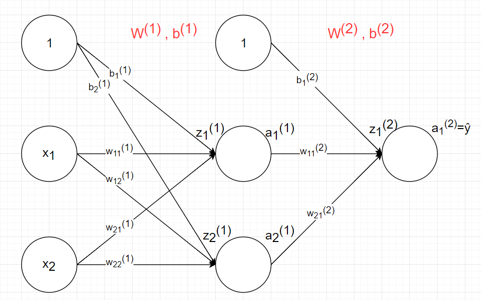

# Basic-Perceptron
This repo includes C++ and Python Sources of some algorithms for Perceptron and Classification. 

Run the C++ programs (in terminal):

step 1: g++ -o output_file filename.cpp

step 2: output_file

Perceptron and Data:

Example Model for Back-Propagation

Tran Le Anh
