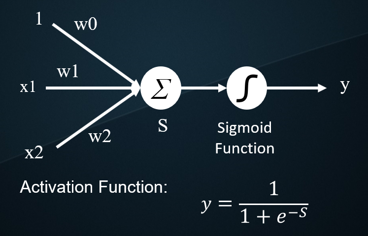
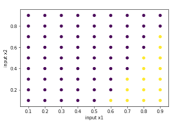

# Basic-Perceptron
This repo includes C++ Sources of Delta Rule and Perceptron Training Algorithm to deal with the And/Or Gate Problem using Single-Layer Perceptron.

run the programs (in terminal):

step 1: g++ -o output_file filename.cpp

step 2: output_file

Perceptron:

Data:

